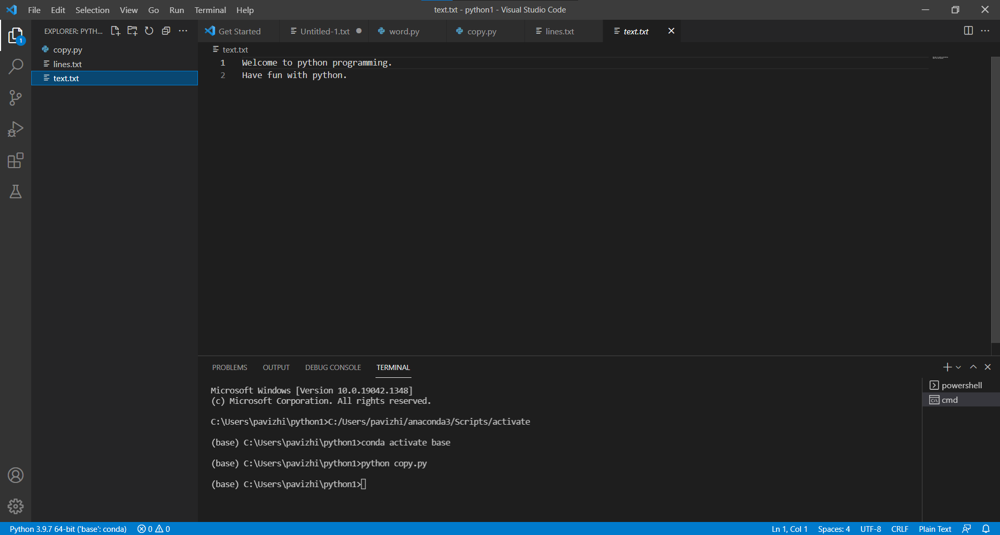

# copy-file
## AIM:
To write a python program for copying the contents from one file to another file.
## EQUIPEMENT'S REQUIRED: 
PC
Anaconda - Python 3.7
## ALGORITHM: 
### Step 1:
Create two txt file.A file which has content [lines.txt] to be copied to the empty [text.txt]file.

### Step 2: 
Using write() function to copy the content from line.txt to empty file,text.txt.
 
### Step 3: 
Save and run the python program in terminal.

### Step 4:  
The text from the lines.txt file is copied to the empty file text.txt.

### Step 5: 
Then the text is shown in empty file text.txt. 

### Step 6: 
Result is obtained.

## PROGRAM:
```
'''
Reference no: 21500608
Developed by: Pavizhi.B
'''
with open('lines.txt','r') as file1:
    with open('text.txt','w') as file2:
        for line in file1:
            file2.write(line)
```

### OUTPUT:
### Program:

### Lines.txt:

### Terminal:

### Text.txt(copied content):



## RESULT:
Thus the program is written to copy the contents from one file to another file.